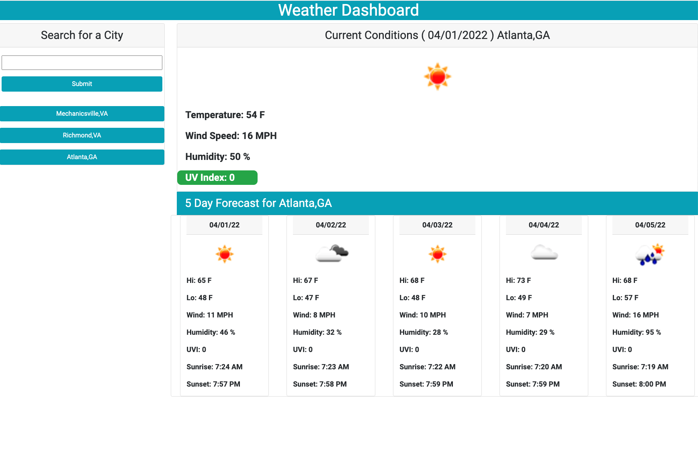

# Weather Dashboard

## Description

An applicaton to get the weather forecast for multiple cities in an easily understandable format.

- The purpose and motivation for this project is to provide desired weather informtion in a concise and easy to use format for any city the user desires.
- I selected weather data to display based on project acceptance criteria and my personal interests and needs.
- This project was an opportunity to learn about server side APIs and get more practice with JavaScript, Jquery, Bootstrap, and Dayjs.
- I have more confidence with JavaScript and Jquery having completed this project.

## Installation

There is no installation required.   Just run the applicaton from GitHub: https://github.com/melliott7264/weather-dashboard/.   City search results are saved to local strorage and you may want to delete that file from time to time.  That can be done from Developer Tools under the Application tab under Local Storage file://.  It should also be erased if you clear all the browser data.

## Usage

Load and run the applicaton from https://github.com/melliott7264/weather-dashboard/.   On initial load,  the weather data for Mechanicsville,VA is displayed.  You can display the weather for any other city by typing the city and state (City,ST) in the search box and clicking on the Submit button.  The weather data for that location will be displayed and the location information saved to local storage and a search button created.  From there on, you can get that city's data by clicking on its search button.  By default,  each time you load/reload the application it will display the weather data for the last search button created.  

## Credits

Mark Elliott  https://github.com/melliott7264

Link to respository with code:  https://github.com/melliott7264/weather-dashboard

## License

Copyright (c) 2022 Mark Elliott

Permission is hereby granted, free of charge, to any person obtaining a copy
of this software and associated documentation files (the "Software"), to deal
in the Software without restriction, including without limitation the rights
to use, copy, modify, merge, publish, distribute, sublicense, and/or sell
copies of the Software, and to permit persons to whom the Software is
furnished to do so, subject to the following conditions:

The above copyright notice and this permission notice shall be included in all
copies or substantial portions of the Software.

THE SOFTWARE IS PROVIDED "AS IS", WITHOUT WARRANTY OF ANY KIND, EXPRESS OR
IMPLIED, INCLUDING BUT NOT LIMITED TO THE WARRANTIES OF MERCHANTABILITY,
FITNESS FOR A PARTICULAR PURPOSE AND NONINFRINGEMENT. IN NO EVENT SHALL THE
AUTHORS OR COPYRIGHT HOLDERS BE LIABLE FOR ANY CLAIM, DAMAGES OR OTHER
LIABILITY, WHETHER IN AN ACTION OF CONTRACT, TORT OR OTHERWISE, ARISING FROM,
OUT OF OR IN CONNECTION WITH THE SOFTWARE OR THE USE OR OTHER DEALINGS IN THE
SOFTWARE.

---
